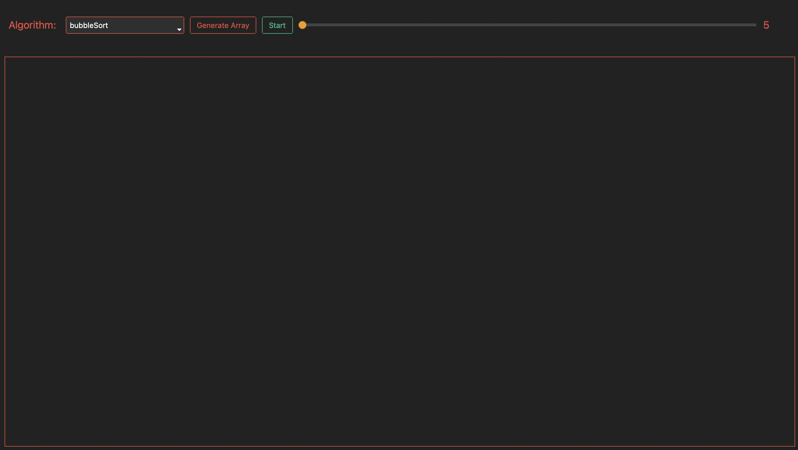
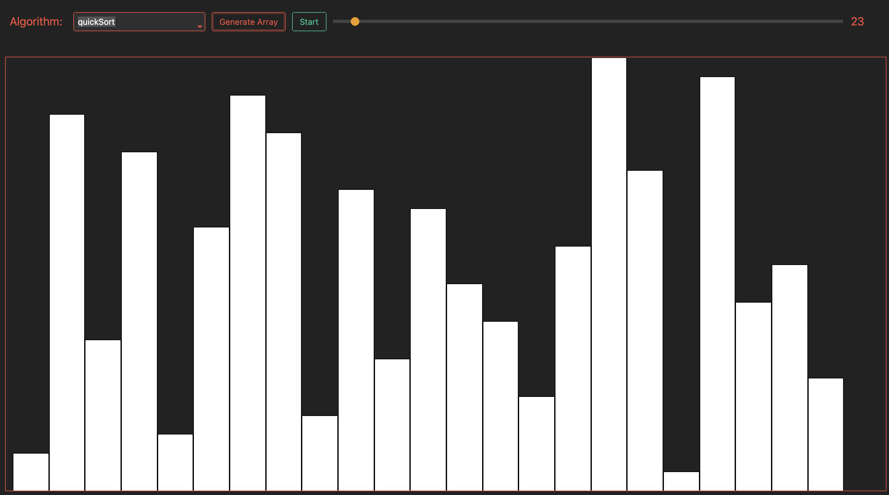
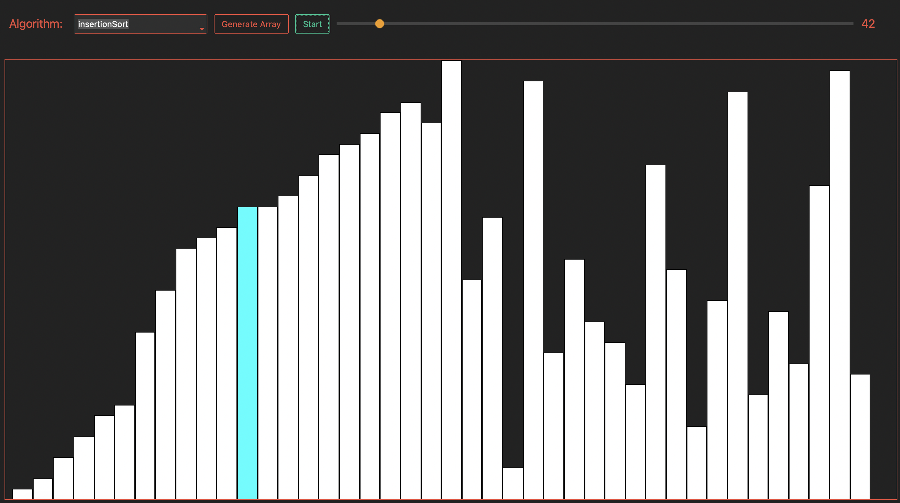
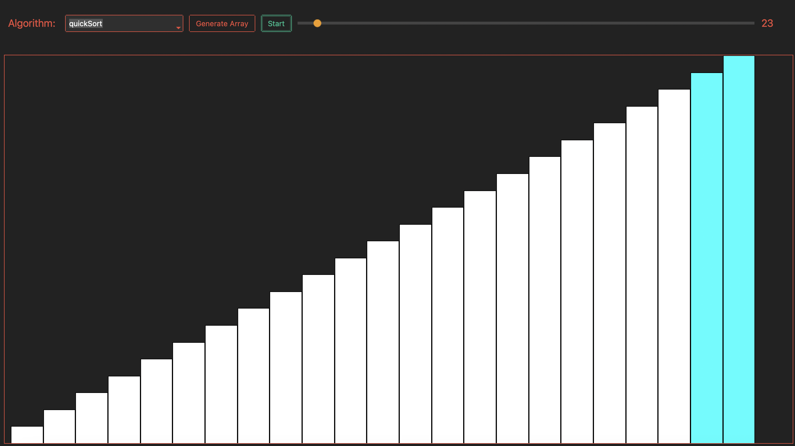

# Sorting Algorithm Visualizer-Java

This program is a sorting algorithm visualizer implemented using Java and its Swing library for GUI.

## Table of Contents

- [Description](#description)
- [Features](#features)
- [Screenshots](#screenshots)
- [Contributing](#contributing)
- [Resources](#resources)

## Motivation

I stumbled upon a sorting algorithm visualizer on YouTube some time ago, and I was immediately captivated by 
the mesmerizing visuals it presented. This experience ignited my curiosity about Computer Science and its underlying 
principles. As I delved deeper into the world of Computer Science, I embarked on a journey to develop my own sorting 
algorithm visualizer. Through this project, I aimed to gain a deeper understanding of sorting algorithms, delve into 
the intricacies of Graphic User Interface frameworks, and master the concepts of Object-Oriented Programming.

## Description

This is an implementation of the sorting algorithm visualizer.
The user can choose the preferred algorithm they would like to sort as well as the size of the array.
The goal for this project to gain practical experience with OOP,
Java Swing Framework and sorting algorithms.

## Features

- Pick algorithm
- Select size of the array
- Generate array
- Sort algorithm
- Repeat

## Screenshots 
+Images rake from Python version 

**Initial View**

**Array Generated**

**Sorting In Progress**

**Sorting Complete**

## Contributing

1. Fork the repository.
2. Create a new branch.
3. Make your changes and commit them.
4. Push to your fork and submit a pull request.

## Resources
- Java Swing Framework: https://docs.oracle.com/javase/tutorial/uiswing/
### Sorting Algorithms:
- bubbleSort: https://en.wikipedia.org/wiki/Bubble_sort
- insertionSort: https://en.wikipedia.org/wiki/Insertion_sort
- mergeSort: https://en.wikipedia.org/wiki/Merge_sort
- quickSort: https://en.wikipedia.org/wiki/Quicksort
- heapSort: https://en.wikipedia.org/wiki/Heapsort
- shellSort: https://en.wikipedia.org/wiki/Shellsort
- combSort: https://en.wikipedia.org/wiki/Comb_sort
- exchangeSort: https://en.wikipedia.org/wiki/Sorting_algorithm

+If you are curious check out Python version of this program
